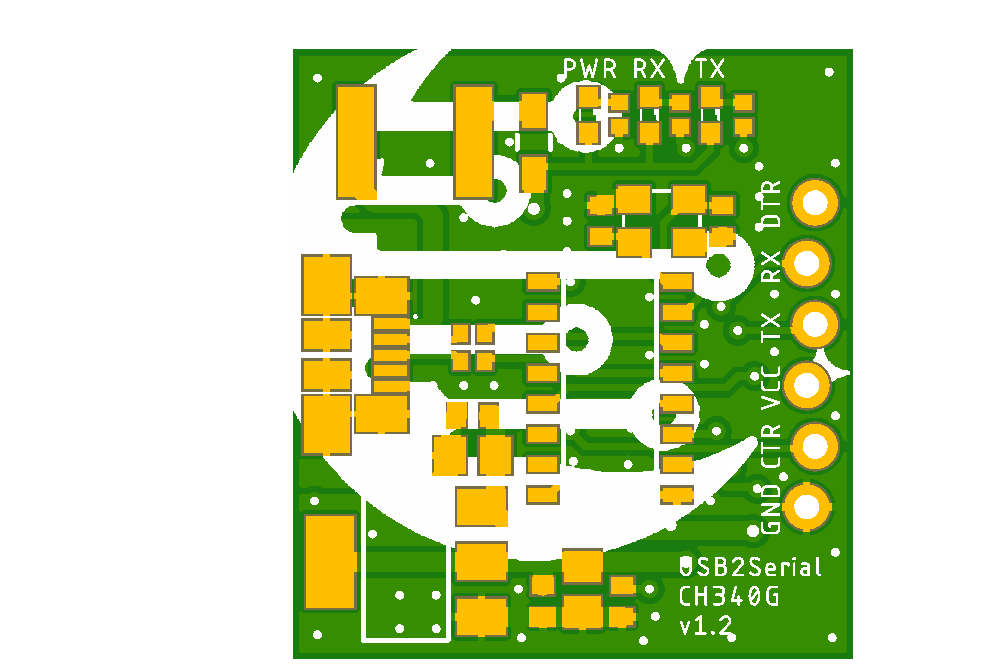
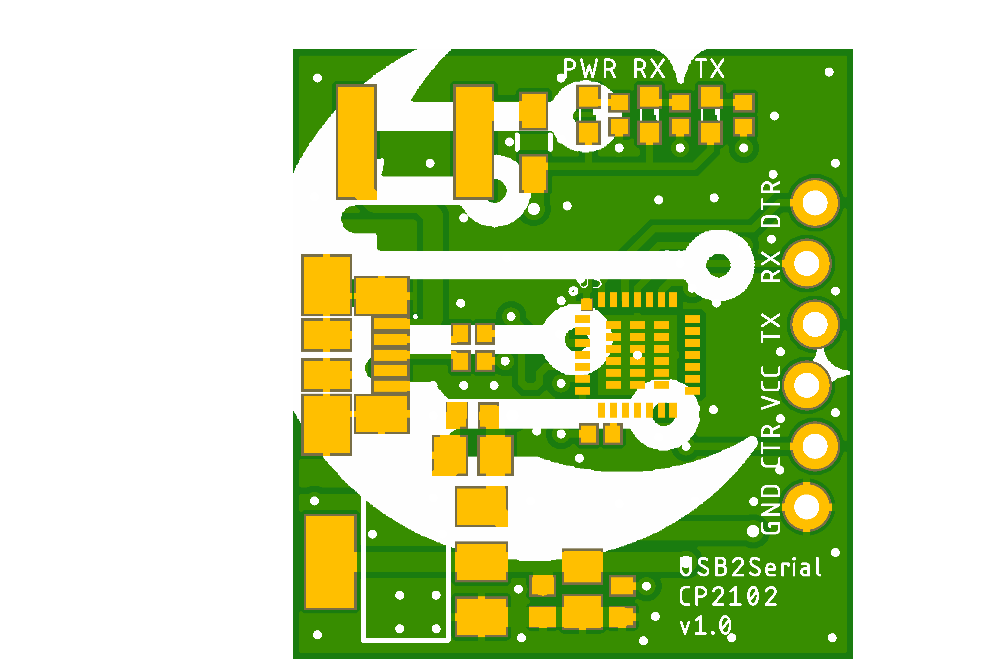

# USB2Serial project

USB to Serial board came as a helping board for my another my project.
I had to program a number of cheap Arduino Pro Mini clone boards in a row.
The problem I was having was to mix up cable all the time.
I decided to fix this issue once and for all by creating a simple USB to Serial interface board which will connect directly with Arduino Pro Mini correctly.

## USB2Serial_CH340G_v1.2

**USB2Serial_CH340G_v1.2** is a simple USB to Serial board based on CH340G chip, created especially to fit well with Arduino Pro Mini boards.

Preview:

[Schematics in PDF format](doc/USB2Serial_CH340G_v1.2.pdf)

Features:

- based on very cheap CH340G chip
- locked pins for Pro Mini
- configurable for 5V and 3.3V

CAM files are available.
BoM and PnP files for JLCPCB are available.

## USB2Serial_FT232RL_v1.0

**USB2Serial_FT232RL_v1.0** is a simple USB to Serial board based on FT232RL chip, created especially to fit well with Arduino Pro Mini boards.

Preview:

[Schematics in PDF format](doc/USB2Serial_FT232RL_v1.0.pdf)

Features:

- based on more common FT232RL chip
- locked pins for Pro Mini
- configurable for 5V and 3.3V

CAM files are available.
BoM and PnP files for JLCPCB are available.

## USB2Serial_CP2102_v1.0

**USB2Serial_CP2102_v1.0** is a simple USB to Serial board based on CP2102 chip, created especially to fit well with Arduino Pro Mini boards.

Preview:

[Schematics in PDF format](doc/USB2Serial_CP2102_v1.0.pdf)

Features:

- based on more common CP2102 chip
- locked pins for Pro Mini
- configurable for 5V and 3.3V

CAM files are available.
BoM and PnP files for JLCPCB are available.

## Links

- CH340G Driver for Windows: [CH341SER_ZIP](http://www.wch.cn/download/CH341SER_ZIP.html)
- FT232RL Driver for Windows: [Home/Drivers/VCP Drivers](https://ftdichip.com/drivers/vcp-drivers/)
- CP2102 Driver for Windows: [CP210x USB to UART Bridge VCP Drivers](https://www.silabs.com/developers/usb-to-uart-bridge-vcp-drivers)

## How to help

Your contributions as code, resources or finances are welcome!
Please contact me directly over e-mail andriy.golovnya@gmail.com or over [GitHub profile](https://github.com/red-scorp).
Link for [Paypal donations](http://paypal.me/redscorp) and [Ko-Fi donations](http://ko-fi.com/redscorp), which are always welcome.
Thanks in advance!
