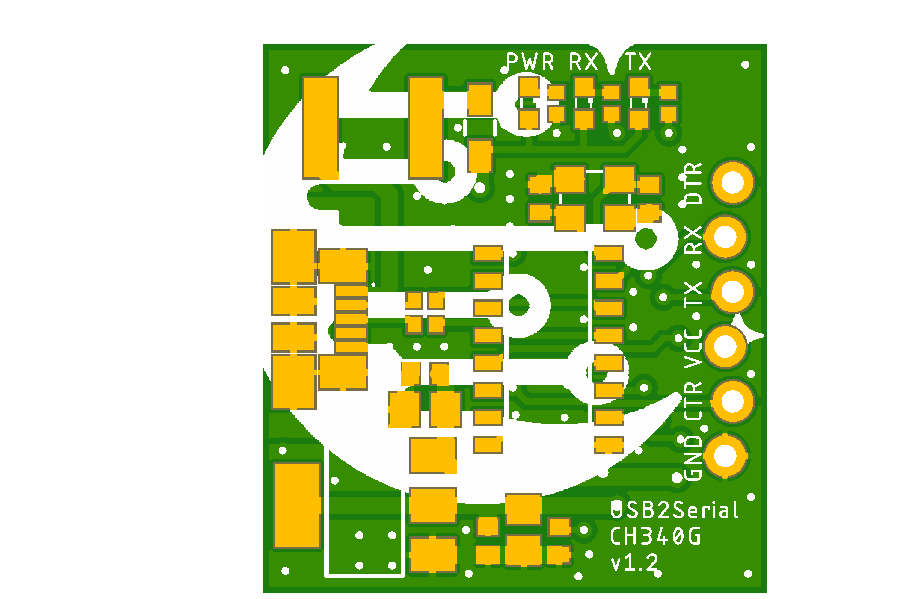
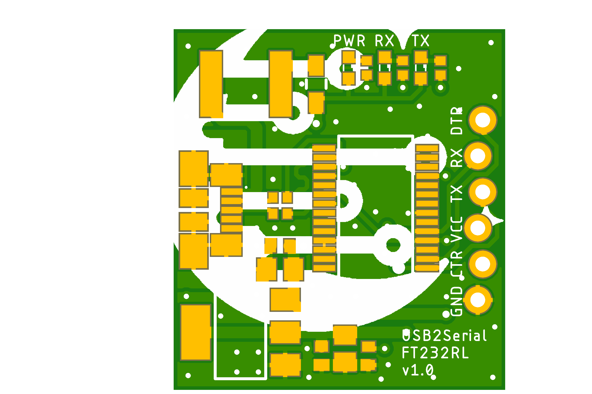

# USB2Serial project

USB to Serial board came as a helping board for my another my project.
I had to program a number of cheap Arduino Pro Mini clone boards in a row.
The problem I was having was to mix up cable all the time.
I decided to fix this issue once and for all by creating a simple USB to Serial interface board which will connect directly with Arduino Pro Mini correctly.

## USB2Serial_CH340G_v1.0

**USB2Serial_CH340G_v1.0** is a simple USB to Serial board based on CH340G chip, created especially to fit well with Arduino Pro Mini boards.

Preview:

[Schematics in PDF format](USB2Serial_CH340G_v1.0.pdf)

Features:

- based on cheap CH340G chip
- configurable for 5V and 3.3V

CAM files are available.
BOM and PnP files are available.

## USB2Serial_CH340G_v1.1

**USB2Serial_CH340G_v1.1** is an advancement of v1.0 design.
The only difference here is a row of locked holes to allow to use it without soldering female header on the board.

Preview:

[Schematics in PDF format](USB2Serial_CH340G_v1.1.pdf)

Features:

- based on cheap CH340G chip
- locked pins for Pro Mini
- configurable for 5V and 3.3V

CAM files are available.
Use BOM and PnP from v1.0.

## USB2Serial_CH340G_v1.2

**USB2Serial_CH340G_v1.2** is an advancement of v1.1 design.
The only difference here is an extra capacitor on 5V line.

Preview:

[Schematics in PDF format](USB2Serial_CH340G_v1.2.pdf)

Features:

- based on cheap CH340G chip
- locked pins for Pro Mini
- configurable for 5V and 3.3V

CAM files are available.

## USB2Serial_FT232RL_v1.0

**USB2Serial_FT232RL_v1.0** is a simple USB to Serial board based on FT232RL chip, created especially to fit well with Arduino Pro Mini boards.

Preview:

[Schematics in PDF format](USB2Serial_FT232RL_v1.0.pdf)

Features:

- based on cheap FT232RL chip
- locked pins for Pro Mini
- configurable for 5V and 3.3V

CAM files are available.

## Links

- CH340G Driver for Windows: [CH341SER_ZIP](http://www.wch.cn/download/CH341SER_ZIP.html)
- FT232RL Driver for Windows: [Home/Drivers/VCP Drivers](https://ftdichip.com/drivers/vcp-drivers/)

## How to help

Your contributions as code, resources or finances are welcome!
Please contact me directly over e-mail andriy.golovnya@gmail.com or over [GitHub profile](https://github.com/red-scorp).
Link for [Paypal donations](http://paypal.me/redscorp), which are always welcome.
Thanks in advance!
